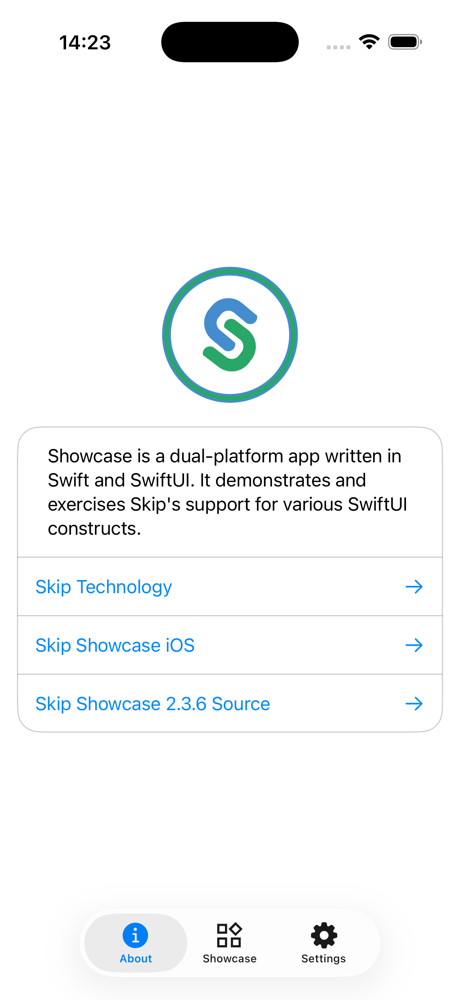
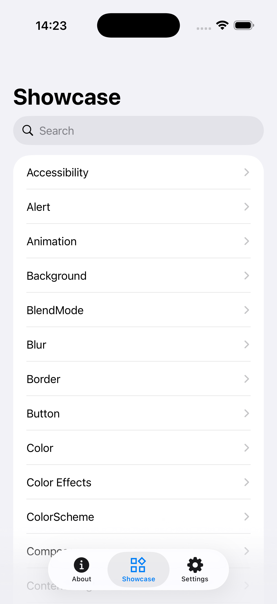
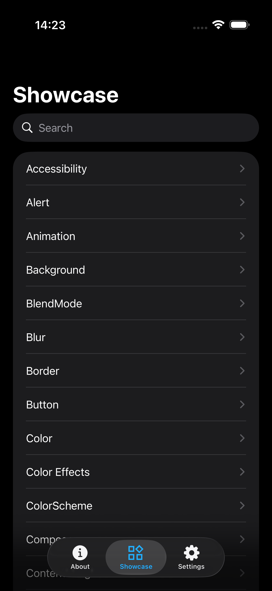
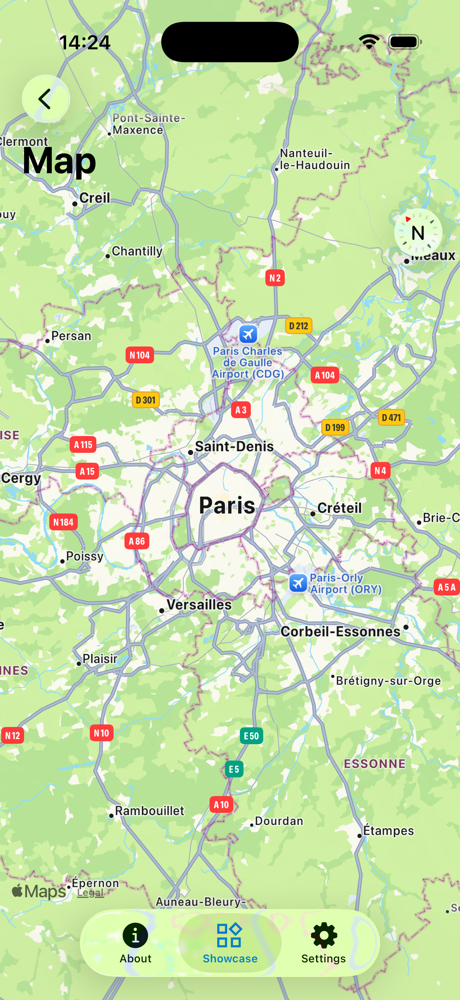
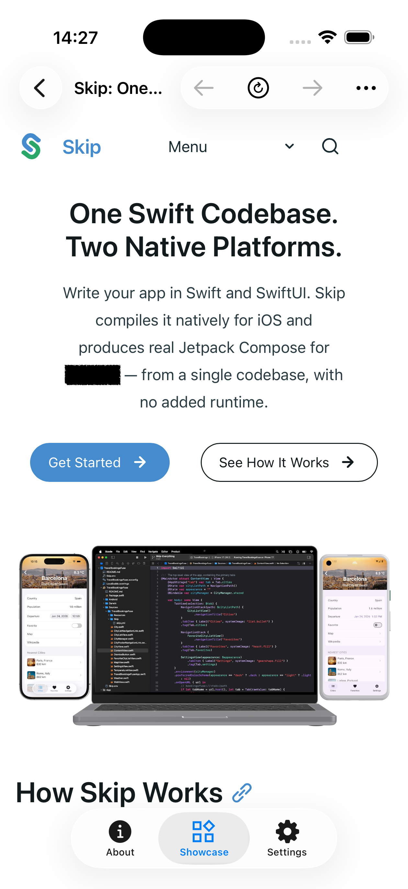
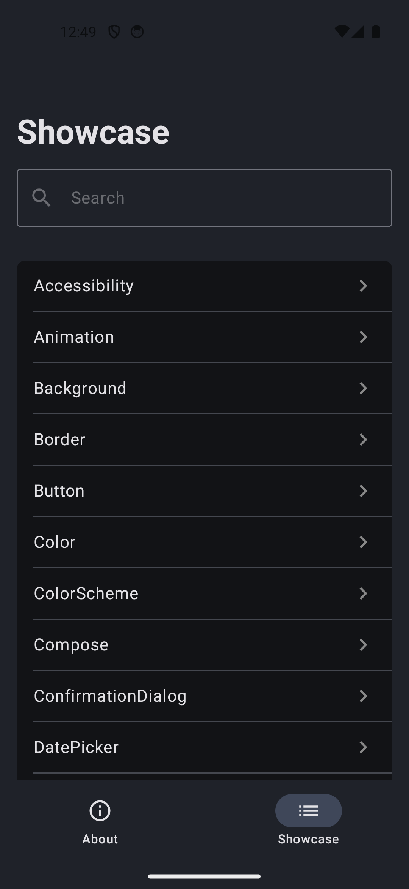
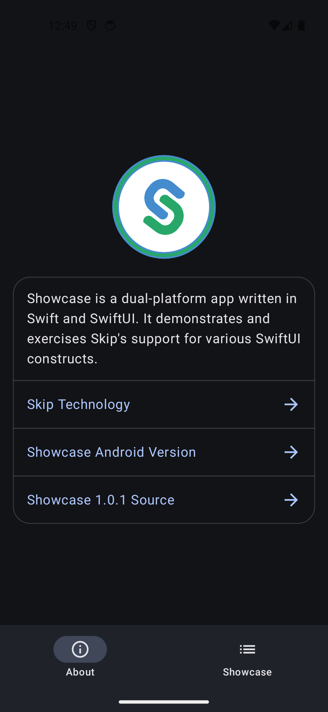
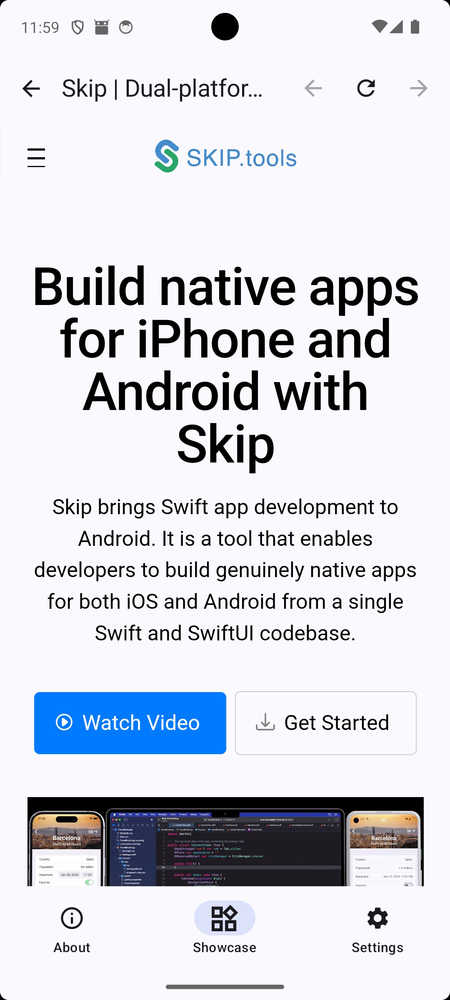

# Skip Showcase

A comprehensive demonstration app for [Skip](https://skip.dev), showcasing cross-platform SwiftUI development for iOS and Android. This is a combination [Skip Lite](https://skip.dev/docs/modes/) and [Skip Fuse](https://skip.dev/docs/modes/) app that can be condfigured to run in either transpiled or native mode.

The app contains 90+ interactive playgrounds, each demonstrating a specific SwiftUI component, layout technique, or framework integration. Every playground renders natively on both iOS and Android from the same Swift source code.

<div align="center">
  <a href="https://play.google.com/store/apps/details?id=org.appfair.app.Showcase" style="display: inline-block;"></a>
  <a href="https://apps.apple.com/us/app/skip-showcase/id6474885022" style="display: inline-block;"></a>
</div>

## iPhone Screenshots

<div align="center" style="margin: 0 auto; justify-content: center; box-sizing: border-box; display: flex; gap: 8px; align-items: center;">
    
</div>


## Android Screenshots

<div align="center" style="margin: 0 auto; justify-content: center; box-sizing: border-box; display: flex; gap: 8px; align-items: center;">
    
</div>


## App Structure

The app uses a three-tab layout defined in [ContentView.swift](https://source.skip.dev/skipapp-showcase/blob/main/Sources/Showcase/ContentView.swift):

- **About** — App info and version details
- **Showcase** — Searchable list of all playgrounds ([PlaygroundListView.swift](https://source.skip.dev/skipapp-showcase/blob/main/Sources/Showcase/PlaygroundListView.swift))
- **Settings** — Appearance and configuration

Each playground is registered as a case in the `PlaygroundType` enum, which provides the title and view. The list is searchable and navigable via `NavigationStack`.

## Framework Dependencies

The showcase integrates 10 Skip framework libraries beyond the core SkipUI, demonstrating how optional frameworks can be composed into a single app:

| Framework | Repository | Purpose |
|---|---|---|
| [SkipFuseUI](https://github.com/skiptools/skip-fuse-ui) | [skip-fuse-ui](https://source.skip.tools/skip-fuse-ui) | Core SwiftUI-to-Compose bridge for Fuse mode |
| [SkipKit](https://github.com/skiptools/skip-kit) | [skip-kit](https://source.skip.tools/skip-kit) | Permissions, document/media pickers, haptics, device info |
| [SkipAV](https://github.com/skiptools/skip-av) | [skip-av](https://source.skip.tools/skip-av) | Video playback (AVKit on iOS, ExoPlayer on Android) |
| [SkipWeb](https://github.com/skiptools/skip-web) | [skip-web](https://source.skip.tools/skip-web) | Embedded web views (WKWebView / android.webkit.WebView) |
| [SkipDevice](https://github.com/skiptools/skip-device) | [skip-device](https://source.skip.tools/skip-device) | Sensors (accelerometer, gyroscope, magnetometer, barometer) and location |
| [SkipMotion](https://github.com/skiptools/skip-motion) | [skip-motion](https://source.skip.tools/skip-motion) | Lottie animations |
| [SkipKeychain](https://github.com/skiptools/skip-keychain) | [skip-keychain](https://source.skip.tools/skip-keychain) | Keychain / EncryptedSharedPreferences |
| [SkipSQL](https://github.com/skiptools/skip-sql) | [skip-sql](https://source.skip.tools/skip-sql) | SQLite database access |
| [SkipNotify](https://github.com/skiptools/skip-notify) | [skip-notify](https://source.skip.tools/skip-notify) | Push and local notifications |
| [SkipAuthenticationServices](https://github.com/skiptools/skip-authentication-services) | [skip-authentication-services](https://source.skip.tools/skip-authentication-services) | Web authentication sessions (OAuth flows) |

## Playground Guide

Every playground file is in [Sources/Showcase/](https://source.skip.dev/skipapp-showcase/blob/main/Sources/Showcase/) and links to its source via the toolbar "Source" button. The entries below link to the playground source code and the relevant SkipUI documentation for each component.

### Controls

Interactive input elements that accept user actions.

| Playground | Components | Source |
|---|---|---|
| [Button](https://skip.dev/docs/modules/skip-ui/#supported-swiftui) | Button, Label, button roles, `.bordered`, `.borderedProminent`, `.plain` styles | [ButtonPlayground.swift](https://source.skip.dev/skipapp-showcase/blob/main/Sources/Showcase/ButtonPlayground.swift) |
| [Toggle](https://skip.dev/docs/modules/skip-ui/#supported-swiftui) | Toggle, `.labelsHidden`, `.tint`, `.disabled` | [TogglePlayground.swift](https://source.skip.dev/skipapp-showcase/blob/main/Sources/Showcase/TogglePlayground.swift) |
| [Slider](https://skip.dev/docs/modules/skip-ui/#supported-swiftui) | Slider with ranges, steps, `onEditingChanged` | [SliderPlayground.swift](https://source.skip.dev/skipapp-showcase/blob/main/Sources/Showcase/SliderPlayground.swift) |
| [Stepper](https://skip.dev/docs/modules/skip-ui/#supported-swiftui) | Stepper with Int/Double values, custom bounds | [StepperPlayground.swift](https://source.skip.dev/skipapp-showcase/blob/main/Sources/Showcase/StepperPlayground.swift) |
| [Picker](https://skip.dev/docs/modules/skip-ui/#supported-swiftui) | Picker with `.segmented`, `.menu` styles | [PickerPlayground.swift](https://source.skip.dev/skipapp-showcase/blob/main/Sources/Showcase/PickerPlayground.swift) |
| [DatePicker](https://skip.dev/docs/modules/skip-ui/#supported-swiftui) | DatePicker with date/time modes | [DatePickerPlayground.swift](https://source.skip.dev/skipapp-showcase/blob/main/Sources/Showcase/DatePickerPlayground.swift) |
| [Menu](https://skip.dev/docs/modules/skip-ui/#supported-swiftui) | Menu with primary action, sections, dividers | [MenuPlayground.swift](https://source.skip.dev/skipapp-showcase/blob/main/Sources/Showcase/MenuPlayground.swift) |
| [ProgressView](https://skip.dev/docs/modules/skip-ui/#supported-swiftui) | Circular and linear progress, determinate/indeterminate | [ProgressViewPlayground.swift](https://source.skip.dev/skipapp-showcase/blob/main/Sources/Showcase/ProgressViewPlayground.swift) |

### Text and Typography

Text display, input, and formatting.

| Playground | Components | Source |
|---|---|---|
| [Text](https://skip.dev/docs/modules/skip-ui/#supported-swiftui) | Text with bold, italic, strikethrough, underline, markdown, all font sizes, custom fonts | [TextPlayground.swift](https://source.skip.dev/skipapp-showcase/blob/main/Sources/Showcase/TextPlayground.swift) |
| [TextField](https://skip.dev/docs/modules/skip-ui/#supported-swiftui) | TextField with `.roundedBorder`, `.plain`, custom styles | [TextFieldPlayground.swift](https://source.skip.dev/skipapp-showcase/blob/main/Sources/Showcase/TextFieldPlayground.swift) |
| [SecureField](https://skip.dev/docs/modules/skip-ui/#supported-swiftui) | SecureField with prompts, disabled states | [SecureFieldPlayground.swift](https://source.skip.dev/skipapp-showcase/blob/main/Sources/Showcase/SecureFieldPlayground.swift) |
| [TextEditor](https://skip.dev/docs/modules/skip-ui/#supported-swiftui) | Multi-line text editing | [TextEditorPlayground.swift](https://source.skip.dev/skipapp-showcase/blob/main/Sources/Showcase/TextEditorPlayground.swift) |
| [Label](https://skip.dev/docs/modules/skip-ui/#supported-swiftui) | Label with `.titleAndIcon`, `.titleOnly`, `.iconOnly` styles | [LabelPlayground.swift](https://source.skip.dev/skipapp-showcase/blob/main/Sources/Showcase/LabelPlayground.swift) |
| Line Spacing | `.lineSpacing` modifier with various values | [LineSpacingPlayground.swift](https://source.skip.dev/skipapp-showcase/blob/main/Sources/Showcase/LineSpacingPlayground.swift) |
| Tracking | `.tracking` modifier for letter spacing | [TrackingPlayground.swift](https://source.skip.dev/skipapp-showcase/blob/main/Sources/Showcase/TrackingPlayground.swift) |
| MinimumScaleFactor | `.minimumScaleFactor` for responsive text sizing | [MinimumScaleFactorPlayground.swift](https://source.skip.dev/skipapp-showcase/blob/main/Sources/Showcase/MinimumScaleFactorPlayground.swift) |

### Layout

Spatial arrangement of views.

| Playground | Components | Source |
|---|---|---|
| [Stacks](https://skip.dev/docs/modules/skip-ui/#layout) | HStack, VStack, fixed vs expanding, nested stacks | [StackPlayground.swift](https://source.skip.dev/skipapp-showcase/blob/main/Sources/Showcase/StackPlayground.swift) |
| [Spacer](https://skip.dev/docs/modules/skip-ui/#layout) | Spacer with `minLength`, variable dimensions | [SpacerPlayground.swift](https://source.skip.dev/skipapp-showcase/blob/main/Sources/Showcase/SpacerPlayground.swift) |
| [Frame](https://skip.dev/docs/modules/skip-ui/#layout) | `.frame` with width, height, `.infinity`, aspect ratio | [FramePlayground.swift](https://source.skip.dev/skipapp-showcase/blob/main/Sources/Showcase/FramePlayground.swift) |
| [Grids](https://skip.dev/docs/modules/skip-ui/#grids) | LazyVGrid, LazyHGrid with `.adaptive`, `.flexible`, `.fixed` columns | [GridPlayground.swift](https://source.skip.dev/skipapp-showcase/blob/main/Sources/Showcase/GridPlayground.swift) |
| [Divider](https://skip.dev/docs/modules/skip-ui/#supported-swiftui) | Horizontal/vertical dividers, custom dimensions | [DividerPlayground.swift](https://source.skip.dev/skipapp-showcase/blob/main/Sources/Showcase/DividerPlayground.swift) |
| [GeometryReader](https://skip.dev/docs/modules/skip-ui/#supported-swiftui) | Size reading, safe area insets, local vs global frames | [GeometryReaderPlayground.swift](https://source.skip.dev/skipapp-showcase/blob/main/Sources/Showcase/GeometryReaderPlayground.swift) |
| GeometryChange | `onGeometryChange` for size/position tracking | [GeometryChangePlayground.swift](https://source.skip.dev/skipapp-showcase/blob/main/Sources/Showcase/GeometryChangePlayground.swift) |
| [SafeArea](https://skip.dev/docs/modules/skip-ui/#safe-area) | `.ignoresSafeArea`, edge-to-edge rendering | [SafeAreaPlayground.swift](https://source.skip.dev/skipapp-showcase/blob/main/Sources/Showcase/SafeAreaPlayground.swift) |
| [ViewThatFits](https://skip.dev/docs/modules/skip-ui/#supported-swiftui) | Adaptive layout along horizontal/vertical axes | [ViewThatFitsPlayground.swift](https://source.skip.dev/skipapp-showcase/blob/main/Sources/Showcase/ViewThatFitsPlayground.swift) |
| ContentMargins | `.contentMargins`, `scrollContentPlacement` | [ContentMarginsPlayground.swift](https://source.skip.dev/skipapp-showcase/blob/main/Sources/Showcase/ContentMarginsPlayground.swift) |

### Navigation and Presentation

Screen flow and modal presentation.

| Playground | Components | Source |
|---|---|---|
| [NavigationStack](https://skip.dev/docs/modules/skip-ui/#navigation) | NavigationStack, NavigationLink, path binding, `navigationDestination` | [NavigationStackPlayground.swift](https://source.skip.dev/skipapp-showcase/blob/main/Sources/Showcase/NavigationStackPlayground.swift) |
| [Sheet](https://skip.dev/docs/modules/skip-ui/#modals) | Sheet, FullScreenCover, PresentationDetent, `onDismiss` | [SheetPlayground.swift](https://source.skip.dev/skipapp-showcase/blob/main/Sources/Showcase/SheetPlayground.swift) |
| [Alert](https://skip.dev/docs/modules/skip-ui/#supported-swiftui) | Alert with text/secure field inputs | [AlertPlayground.swift](https://source.skip.dev/skipapp-showcase/blob/main/Sources/Showcase/AlertPlayground.swift) |
| [ConfirmationDialog](https://skip.dev/docs/modules/skip-ui/#supported-swiftui) | Action sheets with custom cancel, scrolling content | [ConfirmationDialogPlayground.swift](https://source.skip.dev/skipapp-showcase/blob/main/Sources/Showcase/ConfirmationDialogPlayground.swift) |
| [ContextMenu](https://skip.dev/docs/modules/skip-ui/#supported-swiftui) | Long-press menus with labels and destructive actions | [ContextMenuPlayground.swift](https://source.skip.dev/skipapp-showcase/blob/main/Sources/Showcase/ContextMenuPlayground.swift) |
| [TabView](https://skip.dev/docs/modules/skip-ui/#supported-swiftui) | Tabs with badges, custom icons, programmatic selection | [TabViewPlayground.swift](https://source.skip.dev/skipapp-showcase/blob/main/Sources/Showcase/TabViewPlayground.swift) |
| [Toolbar](https://skip.dev/docs/modules/skip-ui/#supported-swiftui) | ToolbarItem placement, custom bar colors, `ToolbarTitleMenu` | [ToolbarPlayground.swift](https://source.skip.dev/skipapp-showcase/blob/main/Sources/Showcase/ToolbarPlayground.swift) |

### Data Display

Lists, scroll views, and content presentation.

| Playground | Components | Source |
|---|---|---|
| [List](https://skip.dev/docs/modules/skip-ui/#lists) | Sections, edit actions (move/delete), refresh, badges, plain style | [ListPlayground.swift](https://source.skip.dev/skipapp-showcase/blob/main/Sources/Showcase/ListPlayground.swift) |
| [ScrollView](https://skip.dev/docs/modules/skip-ui/#scrolling) | ScrollViewReader, LazyVStack/LazyHStack, scroll targets, anchors | [ScrollViewPlayground.swift](https://source.skip.dev/skipapp-showcase/blob/main/Sources/Showcase/ScrollViewPlayground.swift) |
| [Form](https://skip.dev/docs/modules/skip-ui/#supported-swiftui) | Form with mixed control types, button styling, nested sections | [FormPlayground.swift](https://source.skip.dev/skipapp-showcase/blob/main/Sources/Showcase/FormPlayground.swift) |
| [DisclosureGroup](https://skip.dev/docs/modules/skip-ui/#supported-swiftui) | Expandable sections, `isExpanded` binding, nested groups | [DisclosureGroupPlayground.swift](https://source.skip.dev/skipapp-showcase/blob/main/Sources/Showcase/DisclosureGroupPlayground.swift) |
| [Searchable](https://skip.dev/docs/modules/skip-ui/#supported-swiftui) | `.searchable` on List, Grid, LazyVStack, `onSubmit` | [SearchablePlayground.swift](https://source.skip.dev/skipapp-showcase/blob/main/Sources/Showcase/SearchablePlayground.swift) |

### Colors and Styling

Visual appearance customization.

| Playground | Components | Source |
|---|---|---|
| [Color](https://skip.dev/docs/modules/skip-ui/#colors) | System colors, RGB, HSV, opacity, custom asset colors | [ColorPlayground.swift](https://source.skip.dev/skipapp-showcase/blob/main/Sources/Showcase/ColorPlayground.swift) |
| [ColorScheme](https://skip.dev/docs/modules/skip-ui/#colorscheme) | `.preferredColorScheme`, light/dark switching | [ColorSchemePlayground.swift](https://source.skip.dev/skipapp-showcase/blob/main/Sources/Showcase/ColorSchemePlayground.swift) |
| Color Effects | `.brightness`, `.contrast`, `.saturation`, `.hueRotation`, `.grayscale`, `.colorInvert` | [ColorEffectsPlayground.swift](https://source.skip.dev/skipapp-showcase/blob/main/Sources/Showcase/ColorEffectsPlayground.swift) |
| [Gradient](https://skip.dev/docs/modules/skip-ui/#supported-swiftui) | LinearGradient, RadialGradient, EllipticalGradient | [GradientPlayground.swift](https://source.skip.dev/skipapp-showcase/blob/main/Sources/Showcase/GradientPlayground.swift) |
| Background | `.background` with colors, gradients, shapes | [BackgroundPlayground.swift](https://source.skip.dev/skipapp-showcase/blob/main/Sources/Showcase/BackgroundPlayground.swift) |

### Shapes and Visual Effects

Drawing, shapes, and visual modifiers.

| Playground | Components | Source |
|---|---|---|
| [Shape](https://skip.dev/docs/modules/skip-ui/#shapes-and-paths) | Circle, Capsule, Rectangle, RoundedRectangle, Ellipse, UnevenRoundedRectangle | [ShapePlayground.swift](https://source.skip.dev/skipapp-showcase/blob/main/Sources/Showcase/ShapePlayground.swift) |
| Border | `.border`, padding, `.clipShape` | [BorderPlayground.swift](https://source.skip.dev/skipapp-showcase/blob/main/Sources/Showcase/BorderPlayground.swift) |
| Blur | `.blur(radius:)` on shapes and text | [BlurPlayground.swift](https://source.skip.dev/skipapp-showcase/blob/main/Sources/Showcase/BlurPlayground.swift) |
| Shadow | `.shadow` with color, radius, x/y offset | [ShadowPlayground.swift](https://source.skip.dev/skipapp-showcase/blob/main/Sources/Showcase/ShadowPlayground.swift) |
| BlendMode | `.blendMode` (multiply, screen, overlay, and 10+ others) | [BlendModePlayground.swift](https://source.skip.dev/skipapp-showcase/blob/main/Sources/Showcase/BlendModePlayground.swift) |
| Mask | `.mask` with shapes, gradients, and text | [MaskPlayground.swift](https://source.skip.dev/skipapp-showcase/blob/main/Sources/Showcase/MaskPlayground.swift) |
| Overlay | `.overlay` with colors, shapes, custom content | [OverlayPlayground.swift](https://source.skip.dev/skipapp-showcase/blob/main/Sources/Showcase/OverlayPlayground.swift) |
| Redacted | `.redacted(reason: .placeholder)` content masking | [RedactedPlayground.swift](https://source.skip.dev/skipapp-showcase/blob/main/Sources/Showcase/RedactedPlayground.swift) |
| ZIndex | `.zIndex` for layering control in ZStack | [ZIndexPlayground.swift](https://source.skip.dev/skipapp-showcase/blob/main/Sources/Showcase/ZIndexPlayground.swift) |

### Images and Symbols

Image display, remote loading, and iconography.

| Playground | Components | Source |
|---|---|---|
| [Image](https://skip.dev/docs/modules/skip-ui/#images) | Asset images (JPEG, SVG), system images, AsyncImage (remote URLs), `.aspectRatio`, `.clipShape` | [ImagePlayground.swift](https://source.skip.dev/skipapp-showcase/blob/main/Sources/Showcase/ImagePlayground.swift) |
| [Icons](https://skip.dev/docs/modules/skip-ui/#images) | Custom asset icons with various colors | [IconPlayground.swift](https://source.skip.dev/skipapp-showcase/blob/main/Sources/Showcase/IconPlayground.swift) |
| [Symbol](https://skip.dev/docs/modules/skip-ui/#system-symbols) | `Image(systemName:)` with font sizing, multiple variations | [SymbolPlayground.swift](https://source.skip.dev/skipapp-showcase/blob/main/Sources/Showcase/SymbolPlayground.swift) |
| Graphics | `.grayscale`, image composition, rotation effects | [GraphicsPlayground.swift](https://source.skip.dev/skipapp-showcase/blob/main/Sources/Showcase/GraphicsPlayground.swift) |

### Gestures and Interaction

Touch handling and user input.

| Playground | Components | Source |
|---|---|---|
| [Gesture](https://skip.dev/docs/modules/skip-ui/#gestures) | TapGesture, LongPressGesture, DragGesture, MagnificationGesture, RotationGesture, `@GestureState` | [GesturePlayground.swift](https://source.skip.dev/skipapp-showcase/blob/main/Sources/Showcase/GesturePlayground.swift) |
| Offset/Position | `.offset(x:y:)`, `.position`, coordinate visualization | [OffsetPositionPlayground.swift](https://source.skip.dev/skipapp-showcase/blob/main/Sources/Showcase/OffsetPositionPlayground.swift) |
| Transform | `.rotation3DEffect`, `.scaleEffect` with anchors | [TransformPlayground.swift](https://source.skip.dev/skipapp-showcase/blob/main/Sources/Showcase/TransformPlayground.swift) |
| [Haptic Feedback](https://skip.dev/docs/modules/skip-ui/#haptics) | SensoryFeedback types (success, warning, error, impact, selection) | [HapticFeedbackPlayground.swift](https://source.skip.dev/skipapp-showcase/blob/main/Sources/Showcase/HapticFeedbackPlayground.swift) |

### Animation and Transitions

Animated property changes and view transitions.

| Playground | Components | Source |
|---|---|---|
| [Animation](https://skip.dev/docs/modules/skip-ui/#animation) | `.animation` modifier for opacity, blur, brightness, saturation, scale, border, corner radius | [AnimationPlayground.swift](https://source.skip.dev/skipapp-showcase/blob/main/Sources/Showcase/AnimationPlayground.swift) |
| Transition | `.transition`, `withAnimation`, `.id()`, combined scale/opacity | [TransitionPlayground.swift](https://source.skip.dev/skipapp-showcase/blob/main/Sources/Showcase/TransitionPlayground.swift) |

### State and Data Flow

State management, observation, and persistence.

| Playground | Components | Source |
|---|---|---|
| State | `@State`, `@Binding`, struct mutations, optional state | [StatePlayground.swift](https://source.skip.dev/skipapp-showcase/blob/main/Sources/Showcase/StatePlayground.swift) |
| Observable | `@Observable` (Observation framework), `@Environment` | [ObservablePlayground.swift](https://source.skip.dev/skipapp-showcase/blob/main/Sources/Showcase/ObservablePlayground.swift) |
| [Environment](https://skip.dev/docs/modules/skip-ui/#environment-keys) | Custom EnvironmentKey, `@Environment`, `@Bindable` | [EnvironmentPlayground.swift](https://source.skip.dev/skipapp-showcase/blob/main/Sources/Showcase/EnvironmentPlayground.swift) |
| Preferences | Custom PreferenceKey, `onPreferenceChange` | [PreferencePlayground.swift](https://source.skip.dev/skipapp-showcase/blob/main/Sources/Showcase/PreferencePlayground.swift) |
| Storage | `@AppStorage` for Bool, Double, and Enum types | [StoragePlayground.swift](https://source.skip.dev/skipapp-showcase/blob/main/Sources/Showcase/StoragePlayground.swift) |
| OnSubmit | `.onSubmit` with nested form submission handlers | [OnSubmitPlayground.swift](https://source.skip.dev/skipapp-showcase/blob/main/Sources/Showcase/OnSubmitPlayground.swift) |

### Keyboard and Input

Input method customization.

| Playground | Components | Source |
|---|---|---|
| Keyboard | `.keyboardType`, `.autocorrectionDisabled`, `.scrollDismissesKeyboard`, `.submitLabel`, `.textInputAutocapitalization` | [KeyboardPlayground.swift](https://source.skip.dev/skipapp-showcase/blob/main/Sources/Showcase/KeyboardPlayground.swift) |
| FocusState | `@FocusState` with boolean and enum bindings, programmatic focus | [FocusStatePlayground.swift](https://source.skip.dev/skipapp-showcase/blob/main/Sources/Showcase/FocusStatePlayground.swift) |

### System Integration

Platform features accessible through SwiftUI.

| Playground | Components | Source |
|---|---|---|
| ScenePhase | `@Environment(\.scenePhase)` monitoring (active, background, inactive) | [ScenePhasePlayground.swift](https://source.skip.dev/skipapp-showcase/blob/main/Sources/Showcase/ScenePhasePlayground.swift) |
| [Localization](https://skip.dev/docs/modules/skip-ui/#supported-swiftui) | Bundle localizations, `LocalizedStringResource`, locale-aware date formatting | [LocalizationPlayground.swift](https://source.skip.dev/skipapp-showcase/blob/main/Sources/Showcase/LocalizationPlayground.swift) |
| Accessibility | `.accessibilityLabel`, `.accessibilityValue`, `.accessibilityAddTraits`, `.accessibilityHidden` | [AccessibilityPlayground.swift](https://source.skip.dev/skipapp-showcase/blob/main/Sources/Showcase/AccessibilityPlayground.swift) |
| Link | `Link`, `@Environment(\.openURL)`, `OpenURLAction` | [LinkPlayground.swift](https://source.skip.dev/skipapp-showcase/blob/main/Sources/Showcase/LinkPlayground.swift) |
| ShareLink | `ShareLink` with text and URL sharing, subject/message | [ShareLinkPlayground.swift](https://source.skip.dev/skipapp-showcase/blob/main/Sources/Showcase/ShareLinkPlayground.swift) |
| Pasteboard | `UIPasteboard.general` for copy/paste operations | [PasteboardPlayground.swift](https://source.skip.dev/skipapp-showcase/blob/main/Sources/Showcase/PasteboardPlayground.swift) |
| Timer | Timer-based updates and scheduling | [TimerPlayground.swift](https://source.skip.dev/skipapp-showcase/blob/main/Sources/Showcase/TimerPlayground.swift) |

### Framework Integrations

Playgrounds that demonstrate optional Skip framework libraries beyond core SkipUI.

| Playground | Framework | What it demonstrates | Source |
|---|---|---|---|
| Video Player | [SkipAV](https://github.com/skiptools/skip-av) | VideoPlayer with local, remote, and HLS sources; looping | [VideoPlayerPlayground.swift](https://source.skip.dev/skipapp-showcase/blob/main/Sources/Showcase/VideoPlayerPlayground.swift) |
| Lottie Animation | [SkipMotion](https://github.com/skiptools/skip-motion) | Lottie playback, speed control, loop modes, progress scrubbing | [LottiePlayground.swift](https://source.skip.dev/skipapp-showcase/blob/main/Sources/Showcase/LottiePlayground.swift) |
| WebView | [SkipWeb](https://github.com/skiptools/skip-web) | WebEngine, navigation, JavaScript evaluation | [WebViewPlayground.swift](https://source.skip.dev/skipapp-showcase/blob/main/Sources/Showcase/WebViewPlayground.swift) |
| WebBrowser | [SkipKit](https://github.com/skiptools/skip-kit) | Embedded/system browser launch, custom actions | [WebBrowserPlayground.swift](https://source.skip.dev/skipapp-showcase/blob/main/Sources/Showcase/WebBrowserPlayground.swift) |
| Web Auth Session | [SkipAuthenticationServices](https://github.com/skiptools/skip-authentication-services) | OAuth-style web authentication, callback URL parsing | [WebAuthenticationSessionPlayground.swift](https://source.skip.dev/skipapp-showcase/blob/main/Sources/Showcase/WebAuthenticationSessionPlayground.swift) |
| Document/Media Pickers | [SkipKit](https://github.com/skiptools/skip-kit) | Document and media picking, camera integration | [DocumentPickerPlayground.swift](https://source.skip.dev/skipapp-showcase/blob/main/Sources/Showcase/DocumentPickerPlayground.swift) |
| Keychain | [SkipKeychain](https://github.com/skiptools/skip-keychain) | Keychain read/write, key management | [KeychainPlayground.swift](https://source.skip.dev/skipapp-showcase/blob/main/Sources/Showcase/KeychainPlayground.swift) |
| Notifications | [SkipNotify](https://github.com/skiptools/skip-notify) | Push permission, local notifications | [NotificationPlayground.swift](https://source.skip.dev/skipapp-showcase/blob/main/Sources/Showcase/NotificationPlayground.swift) |
| SQL | [SkipSQL](https://github.com/skiptools/skip-sql) | SQLite CRUD operations, observable database list | [SQLPlayground.swift](https://source.skip.dev/skipapp-showcase/blob/main/Sources/Showcase/SQLPlayground.swift) |
| Map | MapKit (iOS) / [Google Maps Compose](https://developers.google.com/maps/documentation/android-sdk/maps-compose) (Android) | Map display with coordinates, platform-specific rendering | [MapPlayground.swift](https://source.skip.dev/skipapp-showcase/blob/main/Sources/Showcase/MapPlayground.swift) |
| Sensors | [SkipDevice](https://github.com/skiptools/skip-device) | Accelerometer, gyroscope, magnetometer, barometer, location | [SensorsPlayground.swift](https://source.skip.dev/skipapp-showcase/blob/main/Sources/Showcase/SensorsPlayground.swift) |

### Android-Specific Integration

These playgrounds demonstrate Skip's escape hatches for accessing native Android APIs from SwiftUI.

| Playground | Technique | Source |
|---|---|---|
| [Compose](https://skip.dev/docs/modules/skip-ui/#composeview) | `ComposeView` with custom `ContentComposer` for direct Jetpack Compose rendering | [ComposePlayground.swift](https://source.skip.dev/skipapp-showcase/blob/main/Sources/Showcase/ComposePlayground.swift) |
| [Modifiers](https://skip.dev/docs/modules/skip-ui/#composemodifier) | `.composeModifier()` for applying native Compose modifiers, custom `ViewModifier` | [ModifierPlayground.swift](https://source.skip.dev/skipapp-showcase/blob/main/Sources/Showcase/ModifierPlayground.swift) |

### Game

| Playground | Description | Source |
|---|---|---|
| Easter Egg | A complete Block Blast game with drag-and-drop piece placement, line clearing, combos, scoring, and haptic feedback. Demonstrates complex state management with `@Observable`, `GeometryReader` for board sizing, and `DragGesture` with global coordinate space. | [GamePlayground.swift](https://source.skip.dev/skipapp-showcase/blob/main/Sources/Showcase/GamePlayground.swift) |

## Notable Techniques

### Platform Branching with `#if os(Android)`

Several playgrounds demonstrate how to provide platform-specific implementations when SwiftUI alone is insufficient. The [MapPlayground](https://source.skip.dev/skipapp-showcase/blob/main/Sources/Showcase/MapPlayground.swift) is the clearest example: it uses SwiftUI `Map` on iOS and `ComposeView` with Google Maps Compose on Android, sharing the same coordinate data.

### ComposeView for Native Android UI

The [ComposePlayground](https://source.skip.dev/skipapp-showcase/blob/main/Sources/Showcase/ComposePlayground.swift) shows how to embed raw Jetpack Compose code within a SwiftUI hierarchy using `ComposeView` and a custom `ContentComposer`. This is Skip's escape hatch for rendering Android-native UI that has no SwiftUI equivalent. The [MapPlayground](https://source.skip.dev/skipapp-showcase/blob/main/Sources/Showcase/MapPlayground.swift) uses this technique in production to embed Google Maps.

### Custom ViewModifier

The [ModifierPlayground](https://source.skip.dev/skipapp-showcase/blob/main/Sources/Showcase/ModifierPlayground.swift) demonstrates reusable `ViewModifier` implementations (like `DismissModifier`) and the `.composeModifier()` API for applying native Compose modifiers on Android. This is useful for Material 3 theming or Android-specific visual effects.

### Complex State Management

The [GamePlayground](https://source.skip.dev/skipapp-showcase/blob/main/Sources/Showcase/GamePlayground.swift) demonstrates managing complex interactive state across a game board, piece tray, and score system using `@Observable` and multiple `@State` variables. It shows how `DragGesture` with `.global` coordinate space, `GeometryReader` for layout measurement, and `DispatchQueue.main.asyncAfter` for timed effects all work cross-platform.

### Sensor Visualization

The [SensorsPlayground](https://source.skip.dev/skipapp-showcase/blob/main/Sources/Showcase/SensorsPlayground.swift) demonstrates `AsyncThrowingStream` consumption from device sensors using the `.task(id:)` modifier pattern. Each sensor card starts/stops monitoring based on a boolean toggle, and the task automatically cancels when the toggle changes. Location monitoring includes runtime permission handling via `PermissionManager`.

### Gradle Dependencies in skip.yml

The Map playground requires an Android Gradle dependency for Google Maps Compose. This is configured in [Sources/Showcase/Skip/skip.yml](https://source.skip.dev/skipapp-showcase/blob/main/Sources/Showcase/Skip/skip.yml):

```yaml
build:
  contents:
    - block: 'dependencies'
      contents:
        - 'implementation("com.google.maps.android:maps-compose:6.4.1")'
```

## Building

This project is both a stand-alone Swift Package Manager module,
as well as an Xcode project that builds and transpiles the project
into a Kotlin Gradle project for Android using the Skip plugin.

## Testing

The module can be tested using the standard `swift test` command
or by running the test target for the macOS destination in Xcode,
which will run the Swift tests as well as the transpiled
Kotlin JUnit tests in the Robolectric Android simulation environment.

Parity testing can be performed with `skip test`,
which will output a table of the test results for both platforms.

## Running

Xcode and Android Studio must be downloaded and installed in order to
run the app in the iOS simulator / Android emulator.
An Android emulator must already be running, which can be launched from
Android Studio's Device Manager.

To run both the Swift and Kotlin apps simultaneously,
launch the Showcase target from Xcode.
A build phases runs the "Launch Android APK" script that
will deploy the transpiled app a running Android emulator or connected device.
Logging output for the iOS app can be viewed in the Xcode console, and in
Android Studio's logcat tab for the transpiled Kotlin app.
